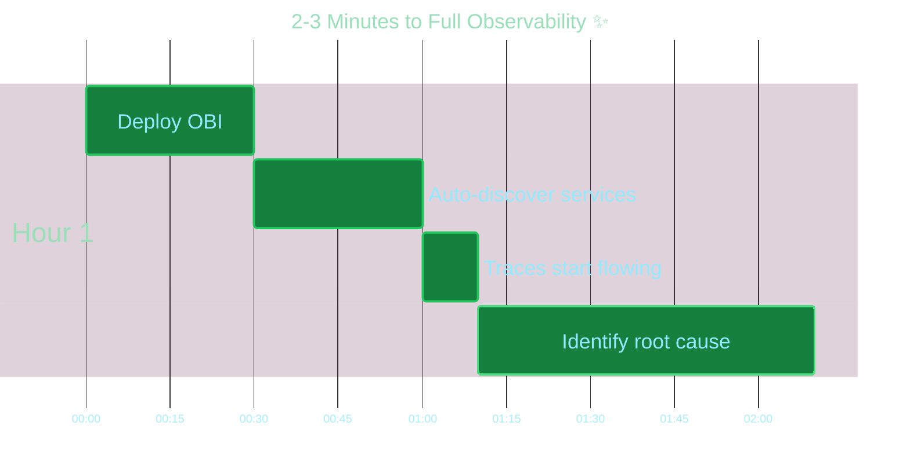
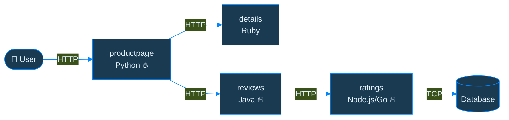

# Debugging Your Cluster When It's on Fire 🔥

Nikola Grcevski, Grafana Labs & Tyler Yahn, Splunk

<!--
Speaker: Tyler (with Nikola introducing himself)
-->

---
layout: default
---

# The 3 AM Page 📞

## The Scenario

🔥 Production experiencing intermittent failures  
🌐 Multiple services in different languages  
💾 Databases showing connection issues  
👥 Users reporting slow responses and errors

## The Pressure

⏰ **Fix it NOW**  
🚫 Without breaking it further  
🔍 Limited visibility  
😰 Stress level: **MAXIMUM**

Sound familiar? 😅

<!--
Speaker: Tyler

- We've all been here - production is down, users are complaining
- I can speak to this personally ...
- The scenario:
  * Intermittent failures - the worst kind, hard to reproduce
  * Polyglot environment - Python, Java, Ruby, Node.js all talking to each other
  * Database connection issues showing up
  * End users seeing slow responses and errors
- The pressure is real:
  * Need to fix it NOW - every minute costs money and reputation
  * Can't make it worse - no cowboy fixes
  * Limited visibility - you don't have traces or metrics set up yet
  * Maximum stress for the entire team
- Pause for the click: "Sound familiar?"
- This is the reality for most teams without proper observability
-->

---
layout: default
---

# The Traditional Observability Dilemma

## Adding Observability

✏️ Code changes  
🧪 Testing  
🚀 Deployment  
🔄 Service restarts

## During an Incident

❌ Can't restart services  
❌ Can't deploy changes  
❌ Limited visibility into system interactions  
⏰ **Time is running out**

  

### We're stuck in a catch-22! 🔒

  

<!--
Speaker: Nikola
-->

---
layout: default
---

# Observability Time Cost ⏰

## 🐌 Traditional Observability Timeline

```mermaid
---
title: 5-7 Days of Work While Your System Burns 🔥
config:
  theme: base
  themeVariables:
    primaryColor: "#2d1b2e"
    primaryTextColor: "#D62293"
    primaryBorderColor: "#D62293"
    lineColor: "#D62293"
    critBkgColor: "#7f1d1d"
    critBorderColor: "#ef4444"
    activeTaskBkgColor: "#4a1e3a"
    activeTaskBorderColor: "#D62293"
  gantt:
    titleTopMargin: 25
    barHeight: 30
    barGap: 3
    topPadding: 75
    rightPadding: 75
    leftPadding: 75
    gridLineStartPadding: 10
    fontSize: 18
    sectionFontSize: 24
---
gantt
    todayMarker off
    dateFormat HH:mm
    axisFormat %H:%M

    section Day 1
    Instrument Productpage               :a1, 06:00, 3h
    Test & fix                           :a2, after a1, 3h
    Instrument Reviews                   :a3, after a2, 4h
    Build & test                         :a4, after a3, 2h

    section Day 2
    Fix Reviews issues                   :b1, 06:00, 2h
    Instrument Ratings                   :b2, after b1, 3h
    Integration testing                  :b3, after b2, 3h
    Submit 3 PRs                         :b4, after b3, 2h

    section Day 3
    PR reviews & feedback                :c1, 06:00, 3h
    Apply fixes to all 3                 :c2, after c1, 4h
    Re-test integrations                 :c3, after c2, 3h

    section Day 4
    CI/CD for all services               :d1, 06:00, 3h
    Deploy to staging                    :d2, after d1, 2h
    Staging validation                   :d3, after d2, 3h
    Fix staging issues                   :d4, after d3, 2h

    section Day 5
    Production deployment                :e1, 06:00, 3h
    Rolling restarts                     :e2, after e1, 2h
    Finally debug!                       :crit, e3, after e2, 1h
```

😰

## ⚡What We Actually Need

```mermaid
---
title: 2-3 Minutes to Full Observability ✨
config:
  theme: base
  themeVariables:
    primaryColor: "#1a5233"
    primaryTextColor: "#93eaff"
    primaryBorderColor: "#22c55e"
    lineColor: "#22c55e"
    fontSize: 18
    doneTaskBkgColor: "#15803d"
    doneTaskBorderColor: "#22c55e"
    critBkgColor: "#166534"
    critBorderColor: "#4ade80"
  gantt:
    titleTopMargin: 25
    barHeight: 60
    barGap: 4
    topPadding: 75
    rightPadding: 75
    leftPadding: 75
    gridLineStartPadding: 10
    fontSize: 18
    sectionFontSize: 24
---
gantt
    todayMarker off
    dateFormat mm:ss
    axisFormat %M:%S

    section Hour 1
    Deploy OBI                      :done, a1, 00:00, 30s
    Auto-discover services          :done, a2, after a1, 30s
    Traces start flowing            :done, a3, after a2, 10s
    Identify root cause             :crit, done, a4, after a3, 60s
```

🚀

From DAYS → MINUTES

<!--
Speaker: Nikola
-->

---
layout: default
---

# OpenTelemetry in 60 Seconds

## What?

🧰 Observability toolkit  
🏆 **CNCF Incubating Project**  
🌐 Vendor-agnostic  
🔧 Works with most backends

## Why?

⭐ Industry standard for observability  
🔓 No vendor lock-in  
🌍 Rich ecosystem and community support  
💍 One API to rule them all

<strong>But traditional OTel still requires code changes... 🤔</strong>

<!--
Speaker: Tyler

- Quick OpenTelemetry overview for those unfamiliar
- What is it?
  * Open-source observability toolkit - APIs, SDKs, collectors
  * CNCF Incubating project - industry backing and governance
  * Vendor-agnostic - not tied to any specific vendor
  * Works with Grafana, Splunk, DataDog, Honeycomb, etc.
- Why does it matter?
  * Industry standard - most organizations are adopting it
  * No vendor lock-in - instrument once, export anywhere
  * Rich ecosystem - extensive language support and integrations
  * One API to rule them all - consistent across languages
- The catch (click): Traditional OTel requires code changes
  * You need to modify your application code
  * Add SDK dependencies
  * Redeploy your services
  * This is what we're going to solve with OBI
-->

---
layout: default
---

# The eBPF Advantage 🚀

## eBPF Powers

🔧 **Kernel-level** instrumentation  
🚫 **No application changes** required  
⚡ High performance, **low overhead**  
🛡️ Safe and secure by design  
📡 Captures network **and** application data

## Perfect for Production

🔥 Safe during incidents  
📊 Comprehensive visibility  
🎯 Zero configuration  
⚡ Instant activation

The best of both worlds! 🌟

<!--
Speaker: Tyler

- eBPF is the key technology that makes OBI possible
- eBPF Powers:
  * Kernel-level instrumentation - runs in the Linux kernel itself
  * No application changes - doesn't touch your code or binaries
  * High performance, low overhead - <1% CPU impact typically
  * Safe and secure - verified by kernel before execution, can't crash system
  * Captures network AND application data - sees everything
- Perfect for Production incidents:
  * Safe during incidents - can deploy while system is having issues
  * Comprehensive visibility - sees all services, all protocols
  * Zero configuration - no YAML files, no environment variables
  * Instant activation - starts collecting data immediately
- Click: "Best of both worlds"
  * OpenTelemetry's standard observability
  * eBPF's zero-code instrumentation
  * This combination is what makes OBI special
-->

---
layout: default
---

# Introducing OBI 🎉

OpenTelemetry eBPF Instrumentation

## What OBI Does

🔍 **Automatically discovers** services  
📊 **Generates distributed traces**  
🗺️ **Creates service topology** maps  
🌐 **Captures network-level** insights  
🎯 **Zero configuration** required

## Key Benefits

⚡ Deploy in < **30 seconds**  
🚫 **No restarts** needed  
🔧 **Any language** supported  
📈 **Production safe**  
🆓 **Open source**

<!--
Speaker: Tyler

- OBI = OpenTelemetry eBPF Instrumentation
- What OBI Does (the magic):
  * Automatically discovers services - no service registry needed
  * Generates distributed traces - full request path across services
  * Creates service topology maps - visual representation of your architecture
  * Captures network-level insights - protocols, connections, errors
  * Zero configuration - just deploy and go
- Key Benefits (why you should care):
  * Deploy in < 30 seconds - single kubectl command or Helm chart
  * No restarts needed - existing pods keep running
  * Any language supported - Python, Java, Go, Ruby, Node.js, etc.
  * Production safe - eBPF guarantees it won't crash your services
  * Open source - Apache 2.0 license, part of OpenTelemetry project
- This is what we'll demo next - going from nothing to full observability in minutes
-->

---
layout: default
---

# Demo Setup Preview 🎬

## Our Demo App

Istio Bookinfo Sample

📚 **4 core microservices**  
🌍 **4 programming languages**  
📖 Real book review application  
🔥 **With simulated problems!**

## Observability Stack

🔍 **Grafana LGTM stack** for observability  
📊 Service topology visualization  
🎯 **CNCF open-source** tools only  
📈 Real-time insights

```mermaid
%%{init: {'theme':'base', 'themeVariables': { 'primaryColor':'#1a3a52','primaryTextColor':'#e3f2fd','primaryBorderColor':'#0086FF','lineColor':'#0086FF','fontSize':'14px'}}}%%
graph LR
    User([👤 User]) -->|HTTP| ProdPage[productpage<br/>Python 🔥]
    ProdPage -->|HTTP| Details[details<br/>Ruby]
    ProdPage -->|HTTP| Reviews[reviews<br/>Java 🔥]
    Reviews -->|HTTP| Ratings[ratings<br/>Node.js/Go 🔥]
    Ratings -->|TCP| DB[(Database)]
```

<!--
Speaker: Tyler

- Setting context for the demo - what we'll be looking at
- Our Demo App: Istio Bookinfo Sample
  * 4 core microservices - realistic distributed system
  * 4 programming languages - productpage (Python), details (Ruby), reviews (Java), ratings (Node.js)
  * Real book review application - not a toy example
  * With simulated problems! - the 🔥 icons show where issues exist
- Observability Stack:
  * Grafana LGTM stack - Loki (logs), Grafana (dashboards), Tempo (traces), Mimir (metrics)
  * Service topology visualization - see the architecture
  * CNCF open-source tools only - no proprietary dependencies
  * Real-time insights - watch data flow in live
- Architecture diagram explanation:
  * User → productpage (entry point)
  * productpage → details (book info) AND reviews (review text)
  * reviews → ratings (star ratings)
  * ratings → database (persistence)
- Problems we injected (🔥 icons):
  * productpage: Slow response times
  * reviews: Inefficient calls
  * ratings: Database connection issues (this is the main problem we'll find)
- This gives audience a mental map before we dive into the live demo
-->

---
layout: center
---

# 🔥 LIVE DEMO TIME 🔥

## Meet Our Problematic Cluster

⏱️ 5-minute guided tour

✅ Bookinfo application is **running**  
⚠️ Users are **reporting issues**  
📉 Some services showing **problems**  
❓ But **what's really wrong?**

$ kubectl get pods

<!--
Speaker: Nikola driving (Tyler commentary)

-->

---
layout: center
---

# What We Just Accomplished 🏆

⚡

30s

Deployment

📊

10s

First Traces

📝

0

Code Changes

🎯

5m

Root Cause

From Zero to Root Cause in 5 Minutes! 🌟

<strong>See the complete picture - not just your code! 🔭</strong>

<!--
Speaker: Tyler

- WOW MOMENT - Let this sink in! Pause for effect
- Break down what we just witnessed (reinforce the numbers):
  * 30 seconds: Deployed OBI with single command
    - No code changes required
    - No configuration files needed
    - No service restarts
  * 10 seconds later: Distributed traces started flowing
    - Automatic service discovery
    - All 4 microservices instrumented
    - Multiple languages supported seamlessly
  * 0 code changes: Literally zero modifications
    - Didn't touch Python, Java, Ruby, or Node.js code
    - No SDK dependencies added
    - Existing binaries completely unchanged
  * 5 minutes total: Identified exact root cause
    - Ratings service database connection timeout
    - Specific method and error message
    - Complete distributed trace context
- Compare to traditional approach:
  * Traditional: DAYS of development, testing, deployment
  * OBI: 5 MINUTES from deployment to solution
  * 99%+ time savings
- Click: "From Zero to Root Cause in 5 Minutes!"
  * This is the power of eBPF-based instrumentation
  * OpenTelemetry standard + eBPF automation
- Bottom section (click): "See the complete picture - not just your code!"
  * Network calls, database connections, service mesh
  * Things you couldn't see even with manual instrumentation
- Pause here - let audience absorb the magnitude
  * This is your "drop the mic" moment
  * Sets up the value proposition slide
-->

---
layout: center
---

# From Chaos to Clarity ✨

❓ <strong>"Something's wrong"</strong>

→

✅ <strong>"Ratings Service database connection timeout"</strong>

⏰ <strong>Hours</strong> of investigation

→

📊 <strong>5 minutes</strong> to root cause

🔍 <strong>Blind</strong> troubleshooting

→

🎯 <strong>Specific fix</strong> identified

😰 <strong>Stress</strong> and guesswork

→

😌 <strong>Confidence</strong> in solution

🔥 Fighting fires

→

🚀 <strong>Proactive</strong> optimization

<!--
Speaker: Tyler

The Complete Value Story:

Before OBI (The Pain):
- Vague problem statements
- Hours wasted investigating
- Trial and error approach
- High stress for team
- Reactive firefighting

After OBI (The Relief):
- Precise problem identification
- 5 minutes to answer
- Targeted solution
- Team confidence restored
- Proactive optimization possible

The ROI (The Business Case):

🏢 Reduced MTTR (Mean Time To Resolution):
- Traditional: Hours to days
- With OBI: Minutes
- Faster resolution = Less customer impact = Higher availability

💰 Cost Savings:
- No development time needed
- No testing cycles
- No deployment overhead
- Developer time freed for features
- Reduced operational costs

😊 Team Morale:
- Less 3am firefighting
- More sleep for engineers
- Higher job satisfaction
- Better work-life balance
- Reduced burnout

📊 Better Decisions:
- Data-driven fixes instead of guesses
- See real behavior, not assumptions
- Prioritize based on actual impact
- Optimize with confidence
- Measure improvements accurately

This slide speaks to different audiences:
- SREs: Focus on MTTR and stress reduction
- Developers: Focus on time savings
- Product Owners: Focus on cost and decisions
- Execs: Focus on ROI and morale
-->

---
layout: default
---

# By The Numbers 📊

## Time Saved

5-7 days → 5 minutes

Traditional instrumentation vs OBI

99.4% faster

Time to first trace

## Real Impact

$0

Engineering hours to deploy

0 restarts

Zero application downtime

Every minute saved during an incident = happier customers

<!--
Speaker: Tyler

Real numbers from what we just demonstrated:
- Traditional: 5-7 days of work (instrumenting 3 services, PRs, testing, deployment)
- OBI: 5 minutes total (deploy + observe + identify)
- That's 99.4% reduction in time to observability

Cost calculation:
- Traditional: 3-5 engineers × 1-2 days each = 15-40 engineering hours
- OBI: 5 minutes of SRE time
- At $150/hour average loaded cost = $2,250-6,000 saved per incident

Zero downtime:
- No service restarts required
- Safe to deploy during active incidents
- Works with existing binaries

This isn't theory - you just watched it happen live
-->

---
layout: default
---

# What You Need ✅

🐧

Linux Kernel 5.8+

(or RHEL 4.18+ with backports)

💻

x86_64 or arm64

(Standard architectures)

✅ All major cloud providers

If you're running modern Linux containers, you're ready

<!--
Speaker: Nikola

Keep this simple and positive:

Kernel requirement:
- 5.8+ is from 2020 - 5 years old at this point
- RHEL/CentOS 8+ users have backported eBPF (kernel 4.18+)
- Check with: uname -r

Architecture:
- x86_64 (Intel/AMD) - standard everywhere
- arm64 (Graviton, M-series) - growing fast
- Covers 99%+ of production deployments
- Check with: uname -m

The big picture:
- These aren't limitations, they're standard requirements
- 95% of modern K8s clusters already meet these
- Cloud providers: AWS, GCP, Azure, DigitalOcean all qualify
- On-prem: Most recent installations qualify

This is a "check the box" slide, not a blocker slide
-->

---
layout: default
---

# What OBI Observes 🔍

Covers the protocols that matter most

<table class="w-full text-left border-collapse">
<thead>
<tr class="border-b-2 border-blue-500">
<th class="p-4 text-xl font-bold">Category</th>
<th class="p-4 text-xl font-bold">Protocols Supported</th>
<th class="p-4 text-xl font-bold text-center">Coverage</th>
</tr>
</thead>
<tbody>
<tr class="border-b border-gray-700 bg-green-900 bg-opacity-10">
<td class="p-4">

🌐
Web Traffic

</td>
<td class="p-4">HTTP/HTTPS, REST APIs, gRPC</td>
<td class="p-4 text-center">
✅
</td>
</tr>
<tr class="border-b border-gray-700 bg-green-900 bg-opacity-10">
<td class="p-4">

💾
Databases

</td>
<td class="p-4">PostgreSQL, MySQL, MongoDB, Redis</td>
<td class="p-4 text-center">
✅
</td>
</tr>
<tr class="border-b border-gray-700 bg-green-900 bg-opacity-10">
<td class="p-4">

📨
Messaging

</td>
<td class="p-4">Kafka</td>
<td class="p-4 text-center">
✅
</td>
</tr>
<tr class="bg-yellow-900 bg-opacity-10">
<td class="p-4">

📊
Custom Spans

</td>
<td class="p-4">Business logic, internal functions, custom attributes</td>
<td class="p-4 text-center">
➕

SDK instrumentation

</td>
</tr>
</tbody>
</table>

<!--
Speaker: Nikola

Protocol coverage - the practical view:

The table shows what OBI handles automatically vs what needs manual instrumentation

Web traffic (90% of microservices):
- HTTP/HTTPS - covers REST APIs, webhooks, most inter-service calls
- gRPC - growing standard for high-performance services
- Captures request/response, timing, errors

Databases (where most performance issues live):
- PostgreSQL, MySQL - most common SQL databases
- MongoDB - popular NoSQL choice
- Redis - caching, pub/sub, queues
- See connection patterns, slow queries, timeout issues

Messaging (async communication):
- Kafka - event streaming

Custom metrics - the yellow row:
- Business metrics (orders processed, revenue, etc.)
- Internal function tracing
- Application-specific attributes
- OBI collaborates with any manual SDK instrumentation here

The philosophy:
- OBI covers network-level protocols - what services say to each other
- Manual instrumentation covers application logic - what happens inside
- You don't need to choose - use BOTH!

Best practice:
1. Deploy OBI first - instant baseline visibility
2. Identify hot spots from traces
3. Add manual instrumentation to those specific areas for deeper insight
4. Now you have complete observability with minimal effort

This isn't "OBI vs SDK instrumentation" - it's "OBI + SDK instrumentation"
Best of both worlds!
-->

---
layout: default
---

# Try It Yourself 🚀

### 🧪 Try the Demo

<CncfQRCode value="https://github.com/MrAlias/kubecon-na-2025" :width="200" :height="200" :margin="2" />

Be up and exploring < 10 min

### 📖 Docs

<CncfQRCode value="https://opentelemetry.io/docs/zero-code/obi/" :width="200" :height="200" :margin="2" />

Helm charts  
Examples  
Best practices

### 💬 Get Help

<CncfQRCode value="https://cloud-native.slack.com/archives/C08P9L4FPKJ" :width="200" :height="200" :margin="2" />

#### CNCF Slack

`#otel-ebpf-instrumentation`

Active community support

<!--
Speaker: Tyler

Make this tangible - what can they do TODAY?

1. Clone the demo repo - it's all there:
   - Bookinfo application pre-configured
   - OBI deployment scripts
   - Grafana/Tempo/Loki stack ready
   - Takes < 10 minutes start to finish

2. Read production docs if you want to go further:
   - Official Helm charts for production
   - Configuration examples for real scenarios
   - Best practices learned from early adopters

3. Join Slack when you have questions:
   - Active community responds quickly
   - We (speakers) are both active there
   - Share your use case, get specific help

The goal: Deploy in staging before end of day
- Not asking for production commitment
- Just validate it works in YOUR environment
- See the value firsthand
- Then you can make informed decisions

This is a "try it now" moment, not a "think about it" moment
-->

---
layout: default
---

# Join the Community 🤝

## 🗃️ <a href="https://github.com/open-telemetry/opentelemetry-ebpf-instrumentation">Repository</a>

<CncfQRCode value="https://github.com/open-telemetry/opentelemetry-ebpf-instrumentation" :width="200" :height="200" :margin="2" />

`#otel-ebpf-instrumentation`

## 📅 <a href="https://groups.google.com/a/opentelemetry.io/g/calendar-ebpf-instrumentation">SIG Meeting</a>

<CncfQRCode value="https://groups.google.com/a/opentelemetry.io/g/calendar-ebpf-instrumentation" :width="200" :height="200" :margin="2" />

Wednesdays @ 8am PT / 11am ET

<!--
Speaker: Tyler
-->

---
layout: end
---

# Thank You! 🙏

## Tyler Yahn

🏢 Splunk

<a href="https://github.com/MrAlias">
@MrAlias
</a>

## Nikola Grcevski

🏢 Grafana Labs

<a href="https://github.com/grcevski">
@grcevski
</a>

