# Debugging Your Cluster When It's on Fire 🔥

Nikola Grcevski, Grafana Labs & Tyler Yahn, Splunk

<!--
Speaker: Tyler (with Nikola introducing himself)
-->

---
layout: default
---

# The 3 AM Page 📞

## The Scenario

🔥 Production experiencing intermittent failures  
🌐 Multiple services in different languages  
💾 Databases showing connection issues  
👥 Users reporting slow responses and errors

## The Pressure

⏰ **Fix it NOW**  
🚫 Without breaking it further  
🔍 Limited visibility  
😰 Stress level: **MAXIMUM**

Sound familiar? 😅

<!--
Speaker: Tyler
-->

---
layout: default
---

# The Traditional Observability Dilemma

## Adding Observability:

✏️ Code changes  
🧪 Testing  
🚀 Deployment  
🔄 Service restarts

## During an Incident:

❌ Can't restart services  
❌ Can't deploy changes  
❌ Limited visibility into system interactions  
⏰ **Time is running out**

  

### We're stuck in a catch-22! 🔒

  

<!--
Speaker: Nikola
-->

---
layout: default
---

# Observability Time Cost ⏰

## 🐌 Traditional Observability Timeline

😰

## ⚡What We Actually Need

🚀

From DAYS → MINUTES

<!--
Speaker: Nikola
-->

---
layout: default
---

# OpenTelemetry in 60 Seconds

## What?

🧰 Observability toolkit  
🏆 **CNCF Incubating Project**  
🌐 Vendor-agnostic  
🔧 Works with most backends

## Why?

⭐ Industry standard for observability  
🔓 No vendor lock-in  
🌍 Rich ecosystem and community support  
💍 One API to rule them all

<strong>But traditional OTel still requires code changes... 🤔</strong>

<!--
Speaker: Tyler

* Open-source, vendor-agnostic project that provides APIs, SDKs, and other tools to help you add observability to your applications.
* It used to be the case, that if you wanted to add observability to your application, you needed to take a dependency on a vendor’s agent or instrumentation packages.
* This vendor dependency locked you into that relationship
  * Required large code change to switch
* OpenTelemetry prevents this vendor lock in
  * Instrument once with the OpenTelemetry APIs and be compatible with most OSS observability platforms and OpenTelemetry vendor ecosystem
* This high degree of compatibility comes from the rich set of tooling and SDKs OpenTelemetry provides
  * These components allow for the custom processing and exporting of the telemetry data
* Preventing vendor lock-in and interoperability is a big part of OpenTelemetry, but not the only ones
  * Generating large amounts of data is only useful if you can interpret this data.
-->

---
layout: default
---

# The eBPF Advantage 🚀

## eBPF Powers:

🔧 **Kernel-level** instrumentation  
🚫 **No application changes** required  
⚡ High performance, **low overhead**  
🛡️ Safe and secure by design  
📡 Captures network **and** application data

## Perfect for Production:

🔥 Safe during incidents  
📊 Comprehensive visibility  
🎯 Zero configuration  
⚡ Instant activation

The best of both worlds! 🌟

<!--
Speaker: Tyler
-->

---
layout: default
---

# Introducing OBI 🎉

OpenTelemetry eBPF Instrumentation

## What OBI Does:

🔍 **Automatically discovers** services  
📊 **Generates distributed traces**  
🗺️ **Creates service topology** maps  
🌐 **Captures network-level** insights  
🎯 **Zero configuration** required

## Key Benefits:

⚡ Deploy in < **30 seconds**  
🚫 **No restarts** needed  
🔧 **Any language** supported  
📈 **Production safe**  
🆓 **Open source**

<!--
Speaker: Tyler
-->

---
layout: default
---

# Demo Setup Preview 🎬

## Our Demo App:

**Istio Bookinfo Sample**

📚 **4 core microservices**  
🌍 **4 programming languages**  
📖 Real book review application  
🔥 **With simulated problems!**

## Observability Stack:

🔍 **Grafana LGTM stack** for observability  
📊 Service topology visualization  
🎯 **CNCF open-source** tools only  
📈 Real-time insights

```mermaid
%%{init: {'theme':'base', 'themeVariables': { 'primaryColor':'#1a3a52','primaryTextColor':'#e3f2fd','primaryBorderColor':'#0086FF','lineColor':'#0086FF','fontSize':'14px'}}}%%
graph LR
    User([👤 User]) -->|HTTP| ProdPage[productpage<br/>Python 🔥]
    ProdPage -->|HTTP| Details[details<br/>Ruby]
    ProdPage -->|HTTP| Reviews[reviews<br/>Java 🔥]
    Reviews -->|HTTP| Ratings[ratings<br/>Node.js/Go 🔥]
    Ratings -->|TCP| DB[(Database)]
```

<!--
Speaker: Tyler

Architecture Overview:
- User hits the productpage service (Python) - entry point
- Productpage calls details service (Ruby) for book information
- Productpage calls reviews service (Java) for reviews
- Reviews service calls ratings service (Node.js or Go) for star ratings
- Ratings service connects to a database

Problems marked with 🔥:
- Productpage: Slow response times
- Reviews: Inefficient calls
- Ratings: Database connection issues (main problem)

This gives the audience a visual map before the demo so they can follow along
-->

---
layout: center
---

# 🔥 LIVE DEMO TIME 🔥

## Meet Our Problematic Cluster

⏱️ 5-minute guided tour

✅ Bookinfo application is **running**  
⚠️ Users are **reporting issues**  
📉 Some services showing **problems**  
❓ But **what's really wrong?**

$ kubectl get pods

<!--
Speaker: Nikola driving (Tyler commentary)

Set the expectation: This is a 5-minute guided tour
- Creates urgency and keeps audience engaged
- Sets clear time boundary
- Audience will time along with you mentally
-->

---
layout: default
---

# Deploy OBI in 30 Seconds ⚡

Simple deployment script:

$ ./obi.sh

📦 OBI pods starting

🚫 No app restarts needed  

⚡ Instrumentation begins

Watch the magic happen! ✨

<!--
Speaker: Nikola driving (Tyler commentary)
-->

---
layout: default
---

# Immediate Trace Collection 📊

Switching to Grafana observability stack...

## What We're Seeing:

📊 **Traces appearing** within seconds  
🎯 **Automatic service discovery**  
📈 **No configuration** required  
🔍 **Request flows** across services

## Instant Insights:

⏱️ **Timing information**  
🔴 **Error detection**  
🗺️ **Service relationships**  
📊 **Performance metrics**

From zero to observability in seconds! 🚀

<!--
Speaker: Nikola driving (Tyler commentary)
-->

---
layout: default
---

# Service Map Visualization 🗺️

Auto-generated service topology:

## What the Map Shows:

🗺️ **Visual service relationships**  
📊 **Traffic flow patterns**  
🔴 **Services with high error rates**  
⚡ **Response time indicators**

## Immediate Value:

🎯 **Spot bottlenecks** instantly  
📈 **Understand dependencies**  
🔍 **Find problem services**  
🏗️ **See your architecture** clearly

Instantly understand your architecture! 🏗️

<!--
Speaker: Nikola driving (Tyler commentary)
-->

---
layout: default
---

# Drilling Down: Finding Root Cause 🔍

From symptoms to root cause analysis:

1️⃣
Select problematic trace

2️⃣
Walk through distributed spans

3️⃣
Identify slow/failing operations

4️⃣
<strong>Pinpoint exact service and method!</strong>

From chaos to clarity in minutes! ✨

<!--
Speaker: Nikola driving (Tyler commentary)
-->

---
layout: center
---

# What We Just Accomplished 🏆

⚡

30s

Deployment

📊

10s

First Traces

ğŸ“

0

Code Changes

🎯

5m

Root Cause

From Zero to Root Cause in 5 Minutes! 🌟

<strong>See the complete picture - not just your code! 🔭</strong>

<!--
Speaker: Tyler

WOW MOMENT - Let this sink in!

What we just witnessed:
- 30 seconds: Deployed OBI with a single command
  * No code changes
  * No configuration files
  * No service restarts
  
- A few seconds later: Distributed traces started flowing
  * Automatic service discovery
  * All 4 microservices instrumented
  * Multiple languages supported seamlessly
  
- 5 minutes total: Identified exact root cause
  * Ratings service database connection timeout
  * Specific method and error
  * Complete distributed trace context

Compare this to traditional approach:
- Traditional: DAYS of development, testing, deployment
- OBI: 5 MINUTES from deployment to solution

This is the power of eBPF-based instrumentation!

Pause here - let the audience absorb the magnitude of this achievement
This is your "drop the mic" moment before moving into the value proposition
-->

---
layout: center
---

# From Chaos to Clarity ✨

❓ <strong>"Something's wrong"</strong>

→

✅ <strong>"Ratings Service database connection timeout"</strong>

⏰ <strong>Hours</strong> of investigation

→

📊 <strong>5 minutes</strong> to root cause

🔍 <strong>Blind</strong> troubleshooting

→

🎯 <strong>Specific fix</strong> identified

😰 <strong>Stress</strong> and guesswork

→

😌 <strong>Confidence</strong> in solution

🔥 Fighting fires

→

🚀 <strong>Proactive</strong> optimization

<!--
Speaker: Tyler

The Complete Value Story:

Before OBI (The Pain):
- Vague problem statements
- Hours wasted investigating
- Trial and error approach
- High stress for team
- Reactive firefighting

After OBI (The Relief):
- Precise problem identification
- 5 minutes to answer
- Targeted solution
- Team confidence restored
- Proactive optimization possible

The ROI (The Business Case):

🏢 Reduced MTTR (Mean Time To Resolution):
- Traditional: Hours to days
- With OBI: Minutes
- Faster resolution = Less customer impact = Higher availability

💰 Cost Savings:
- No development time needed
- No testing cycles
- No deployment overhead
- Developer time freed for features
- Reduced operational costs

😊 Team Morale:
- Less 3am firefighting
- More sleep for engineers
- Higher job satisfaction
- Better work-life balance
- Reduced burnout

📊 Better Decisions:
- Data-driven fixes instead of guesses
- See real behavior, not assumptions
- Prioritize based on actual impact
- Optimize with confidence
- Measure improvements accurately

This slide speaks to different audiences:
- SREs: Focus on MTTR and stress reduction
- Developers: Focus on time savings
- Product Owners: Focus on cost and decisions
- Execs: Focus on ROI and morale
-->

---
layout: default
---

# By The Numbers 📊

## Time Saved:

5-7 days → 5 minutes

Traditional instrumentation vs OBI

99.4% faster

Time to first trace

## Real Impact:

$0

Engineering hours to deploy

0 restarts

Zero application downtime

Every minute saved during an incident = happier customers

<!--
Speaker: Tyler

Real numbers from what we just demonstrated:
- Traditional: 5-7 days of work (instrumenting 3 services, PRs, testing, deployment)
- OBI: 5 minutes total (deploy + observe + identify)
- That's 99.4% reduction in time to observability

Cost calculation:
- Traditional: 3-5 engineers × 1-2 days each = 15-40 engineering hours
- OBI: 5 minutes of SRE time
- At $150/hour average loaded cost = $2,250-6,000 saved per incident

Zero downtime:
- No service restarts required
- Safe to deploy during active incidents
- Works with existing binaries

This isn't theory - you just watched it happen live
-->

---
layout: default
---

# What You Need ✅

🐧

Linux Kernel 5.8+

(or RHEL 4.18+ with backports)

💻

x86_64 or arm64

(Standard architectures)

✅ All major cloud providers

If you're running modern Linux containers, you're ready

<!--
Speaker: Nikola

Keep this simple and positive:

Kernel requirement:
- 5.8+ is from 2020 - 5 years old at this point
- RHEL/CentOS 8+ users have backported eBPF (kernel 4.18+)
- Check with: uname -r

Architecture:
- x86_64 (Intel/AMD) - standard everywhere
- arm64 (Graviton, M-series) - growing fast
- Covers 99%+ of production deployments
- Check with: uname -m

The big picture:
- These aren't limitations, they're standard requirements
- 95% of modern K8s clusters already meet these
- Cloud providers: AWS, GCP, Azure, DigitalOcean all qualify
- On-prem: Most recent installations qualify

This is a "check the box" slide, not a blocker slide
-->

---
layout: default
---

# What OBI Observes 🔍

Covers the protocols that matter most

<table class="w-full text-left border-collapse">
<thead>
<tr class="border-b-2 border-blue-500">
<th class="p-4 text-xl font-bold">Category</th>
<th class="p-4 text-xl font-bold">Protocols Supported</th>
<th class="p-4 text-xl font-bold text-center">Coverage</th>
</tr>
</thead>
<tbody>
<tr class="border-b border-gray-700 bg-green-900 bg-opacity-10">
<td class="p-4">

🌐
Web Traffic

</td>
<td class="p-4">HTTP/HTTPS, REST APIs, gRPC, WebSockets</td>
<td class="p-4 text-center">
✅
</td>
</tr>
<tr class="border-b border-gray-700 bg-green-900 bg-opacity-10">
<td class="p-4">

💾
Databases

</td>
<td class="p-4">PostgreSQL, MySQL, MongoDB, Redis</td>
<td class="p-4 text-center">
✅
</td>
</tr>
<tr class="border-b border-gray-700 bg-green-900 bg-opacity-10">
<td class="p-4">

📨
Messaging

</td>
<td class="p-4">Kafka, AMQP (RabbitMQ), MQTT</td>
<td class="p-4 text-center">
✅
</td>
</tr>
<tr class="bg-yellow-900 bg-opacity-10">
<td class="p-4">

📊
Custom Spans

</td>
<td class="p-4">Business logic, internal functions, custom attributes</td>
<td class="p-4 text-center">
➕

manual instrumentation

</td>
</tr>
</tbody>
</table>

<!--
Speaker: Nikola

Protocol coverage - the practical view:

The table shows what OBI handles automatically vs what needs manual instrumentation

Web traffic (90% of microservices):
- HTTP/HTTPS - covers REST APIs, webhooks, most inter-service calls
- gRPC - growing standard for high-performance services
- WebSockets - real-time communication
- Captures request/response, timing, errors

Databases (where most performance issues live):
- PostgreSQL, MySQL - most common SQL databases
- MongoDB - popular NoSQL choice
- Redis - caching, pub/sub, queues
- See connection patterns, slow queries, timeout issues

Messaging (async communication):
- Kafka - event streaming
- AMQP - RabbitMQ and similar
- MQTT - IoT and lightweight messaging

Custom metrics - the yellow row:
- This is where manual instrumentation shines
- Business metrics (orders processed, revenue, etc.)
- Internal function tracing
- Application-specific attributes

The philosophy:
- OBI covers network-level protocols - what services say to each other
- Manual instrumentation covers application logic - what happens inside
- You don't need to choose - use BOTH!

Best practice:
1. Deploy OBI first - instant baseline visibility
2. Identify hot spots from traces
3. Add manual instrumentation to those specific areas for deeper insight
4. Now you have complete observability with minimal effort

This isn't "OBI vs manual instrumentation" - it's "OBI + manual instrumentation"
Best of both worlds!
-->

---
layout: default
---

# Try It Yourself 🚀

### 🧪 Try the Demo

<CncfQRCode 
  value="https://github.com/MrAlias/kubecon-na-2025" 
  :width="200"
  :height="200"
  :margin="2"
/>

Be up and exploring < 10 min

### 📖 Docs

<CncfQRCode 
  value="https://opentelemetry.io/docs/zero-code/obi/" 
  :width="200"
  :height="200"
  :margin="2"
/>

Helm charts  
Examples  
Best practices

### 💬 Get Help

<CncfQRCode 
  value="https://cloud-native.slack.com/archives/C08P9L4FPKJ"
  :width="200"
  :height="200"
  :margin="2"
/>

**CNCF Slack**

`#otel-ebpf-instrumentation`

Active community support

<!--
Speaker: Tyler

Make this tangible - what can they do TODAY?

1. Clone the demo repo - it's all there:
   - Bookinfo application pre-configured
   - OBI deployment scripts
   - Grafana/Tempo/Loki stack ready
   - Takes < 10 minutes start to finish

2. Read production docs if you want to go further:
   - Official Helm charts for production
   - Configuration examples for real scenarios
   - Best practices learned from early adopters

3. Join Slack when you have questions:
   - Active community responds quickly
   - We (speakers) are both active there
   - Share your use case, get specific help

The goal: Deploy in staging before end of day
- Not asking for production commitment
- Just validate it works in YOUR environment
- See the value firsthand
- Then you can make informed decisions

This is a "try it now" moment, not a "think about it" moment
-->

---
layout: default
---

# Join the Community 🤝

## 💬 <a href="https://cloud-native.slack.com/archives/C08P9L4FPKJ">CNCF Slack</a>

<CncfQRCode 
  value="https://cloud-native.slack.com/archives/C08P9L4FPKJ"
  :width="200"
  :height="200"
  :margin="2"
/>

`#otel-ebpf-instrumentation `

## 📅 <a href="https://groups.google.com/a/opentelemetry.io/g/calendar-ebpf-instrumentation">SIG Meeting</a>

<CncfQRCode 
  value="https://groups.google.com/a/opentelemetry.io/g/calendar-ebpf-instrumentation" 
  :width="200"
  :height="200"
  :margin="2"
/>

Wednesdays @ 8am PT / 11am ET

<!--
Speaker: Tyler
-->

---
layout: end
---

# Thank You! 🙏

## Tyler Yahn

🏢 Splunk

<a href="https://github.com/MrAlias">
@MrAlias
</a>

## Nikola Grcevski

🏢 Grafana Labs

<a href="https://github.com/grcevski">
@grcevski
</a>

